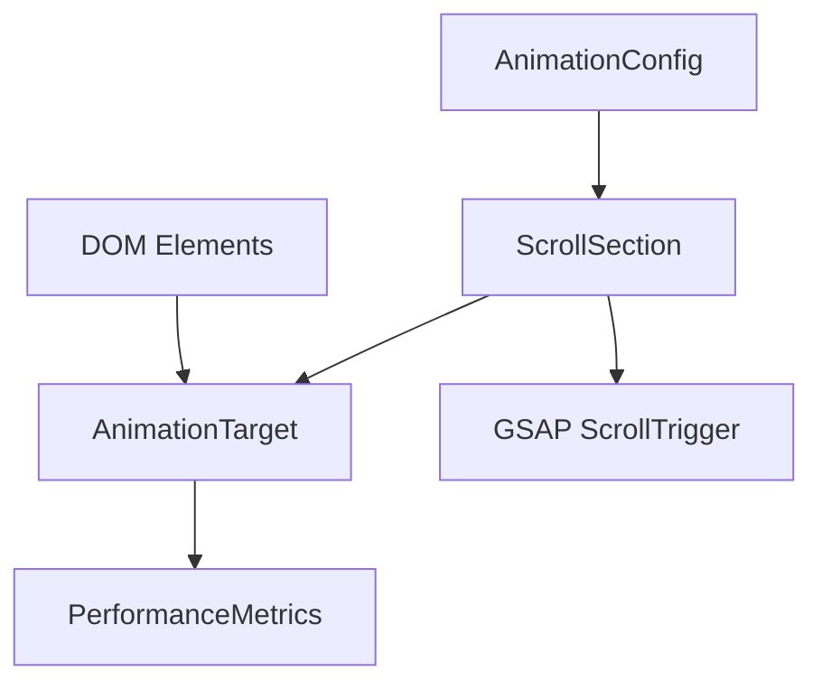

# Phase 1: Data Model

**Feature**: Advanced Scroll Animations for Portfolio  
**Date**: 2025-09-07  

## Entities and Data Structures

### 1. AnimationTarget
Represents an element that will be animated during scroll.

```typescript
interface AnimationTarget {
  element: HTMLElement;
  selector: string;
  animationType: 'fadeIn' | 'slideUp' | 'stagger' | 'parallax';
  startTrigger: string; // e.g., "top 75%"
  endTrigger?: string;  // e.g., "bottom 25%"
  duration: number;     // in seconds
  delay?: number;       // in seconds
  easing: string;       // GSAP easing function
}
```

**Validation Rules**:
- `element` must exist in DOM before animation initialization
- `selector` must be valid CSS selector string
- `duration` must be between 0.1 and 3.0 seconds
- `delay` must be between 0 and 2.0 seconds if specified

### 2. ScrollSection
Represents a portfolio section with its animation configuration.

```typescript
interface ScrollSection {
  id: string;
  title: string;
  element: HTMLElement;
  targets: AnimationTarget[];
  isVisible: boolean;
  hasAnimated: boolean;
  scrollTrigger?: ScrollTrigger; // GSAP ScrollTrigger instance
}
```

**State Transitions**:
- `isVisible: false` → `isVisible: true` (when entering viewport)
- `hasAnimated: false` → `hasAnimated: true` (after first animation)
- Reversible for scroll-back behavior

### 3. AnimationConfig
Global configuration for the animation system.

```typescript
interface AnimationConfig {
  respectsReducedMotion: boolean;
  performanceMode: 'high' | 'medium' | 'low';
  isMobile: boolean;
  frameRate: number;
  debugMode: boolean;
}
```

**Dynamic Updates**:
- `respectsReducedMotion` updates on media query change
- `performanceMode` adjusts based on device performance
- `frameRate` monitored during scroll events

### 4. PerformanceMetrics
Tracking animation performance and user experience.

```typescript
interface PerformanceMetrics {
  averageFrameRate: number;
  droppedFrames: number;
  totalAnimations: number;
  completedAnimations: number;
  loadTime: number;
  scrollEventCount: number;
}
```

## Relationships



## Data Flow

1. **Initialization Phase**:
   - Parse DOM for animation targets using selectors
   - Create `ScrollSection` instances for each portfolio section
   - Generate `AnimationTarget` objects based on configuration
   - Initialize GSAP ScrollTrigger instances

2. **Scroll Event Phase**:
   - ScrollTrigger monitors viewport intersection
   - Updates `isVisible` state for sections
   - Triggers animation sequences for targets
   - Records performance metrics

3. **Animation Phase**:
   - GSAP timeline executes based on target configuration
   - Updates `hasAnimated` state after completion
   - Manages stagger timing between multiple targets
   - Handles animation reversal for scroll-back

## Default Configurations

### Contact Section
```typescript
const contactSection: ScrollSection = {
  id: 'contact-info',
  title: 'Contact Information',
  targets: [
    {
      selector: '.execute-protocol',
      animationType: 'fadeIn',
      startTrigger: 'top 80%',
      duration: 0.6,
      easing: 'power3.out'
    }
  ]
}
```

### Projects Section
```typescript
const projectsSection: ScrollSection = {
  id: 'projects',
  title: 'Project Manifest',
  targets: [
    {
      selector: '.project-entry',
      animationType: 'stagger',
      startTrigger: 'top 75%',
      duration: 0.8,
      delay: 0.1, // between items
      easing: 'back.out(1.7)'
    }
  ]
}
```

### Skills Section
```typescript
const skillsSection: ScrollSection = {
  id: 'skills',
  title: 'Skill Matrix',
  targets: [
    {
      selector: '.skill-category',
      animationType: 'slideUp',
      startTrigger: 'top 70%',
      duration: 0.7,
      delay: 0.15,
      easing: 'power2.out'
    }
  ]
}
```

### Education Section
```typescript
const educationSection: ScrollSection = {
  id: 'education', 
  title: 'Education Log',
  targets: [
    {
      selector: '.education-entry',
      animationType: 'fadeIn',
      startTrigger: 'top 75%',
      duration: 0.6,
      delay: 0.2,
      easing: 'power3.out'
    }
  ]
}
```

## Validation and Error Handling

### Element Validation
- All selectors must match existing DOM elements
- Elements must be visible (not `display: none`)
- Animation targets must support transform properties

### Performance Validation
- Monitor frame rate during animations
- Disable animations if performance drops below 30fps
- Implement fallback styles for animation failures

### Accessibility Validation
- Check `prefers-reduced-motion` media query
- Ensure content remains accessible without animations
- Maintain focus management during animated transitions

---

**Status**: Data model design completed ✅  
**Next**: API contracts and test schemas  